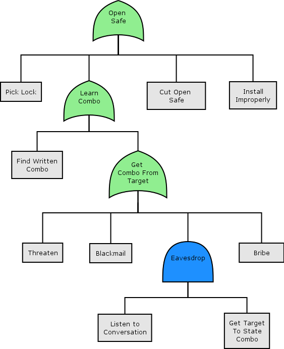

# Attack Tree shapes for [Dia](https://wiki.gnome.org/Apps/Dia)

From [https://www.schneier.com/academic/archives/1999/12/attack_trees.html](https://www.schneier.com/academic/archives/1999/12/attack_trees.html):

> Attack trees provide a formal, methodical way of describing the security of
systems, based on varying attacks. Basically, you represent attacks against a
system in a tree structure, with the goal as the root node and different ways
of achieving that goal as leaf nodes.

This project extends the free and open source [Dia](https://wiki.gnome.org/Apps/Dia)
diagramming tool with a new Sheet for doing Attack Trees:

## Installation

Installation on Linux/Mac is pretty straight-forward:

 1. Check out the repository with `git clone https://github.com/michenriksen/dia-attacktree.git`
 2. Make symbolic links to the diagram shapes with `ln -s /path/to/dia-attacktree/shapes/* ~/.dia/shapes/`
 3. Make symbolic link to the diagram sheet with `ln -s /path/to/dia-attacktree/sheets/AttackTree.sheet ~/.dia/sheets/`
 4. Restart Dia if it's already open

You should now have a new Sheet called Attack Tree, ready to use.
